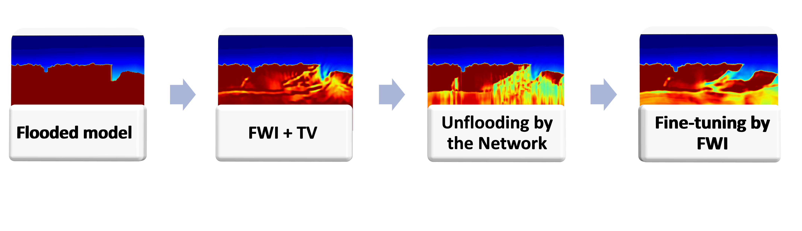

# Automatic unflooding for subsalt waveform inversion
This is an implantation of the salt unflooding in the paper [Deep learning unflooding for robust subsalt waveform inversion
](https://arxiv.org/abs/2201.02947), and EAGE abstract [Automatic unflooding for salt base using U-net in full-waveform inversion framework](https://www.earthdoc.org/content/papers/10.3997/2214-4609.202112691).

**Paper's abstract**

*Full-waveform inversion (FWI), a popular technique that promises high-resolution models, has
helped in improving the salt definition in inverted velocity models. The success of the inversion relies
heavily on having prior knowledge of the salt, and using advanced acquisition technology with long
offsets and low frequencies. Salt bodies are often constructed by recursively picking the top and
bottom of the salt from seismic images corresponding to tomography models, combined with flooding
techniques. The process is time-consuming and highly prone to error, especially in picking the bottom
of the salt (BoS). Many studies suggest performing FWI with long offsets and low frequencies after
constructing the salt bodies to correct the miss-interpreted boundaries. Here, we focus on detecting
the BoS automatically by utilizing deep learning tools. We specifically generate many random 1D
models, containing or free of salt bodies, and calculate the corresponding shot gathers. We then apply
FWI starting with salt flooded versions of those models, and the results of the FWI become inputs
to the neural network, whereas the corresponding true 1D models are the output. The network is
trained in a regression manner to detect the BoS and estimate the subsalt velocity. We analyze three
scenarios in creating the training datasets and test their performance on the 2D BP 2004 salt model.
We show that when the network succeeds in estimating the subsalt velocity, the requirement of low
frequencies and long offsets are somewhat mitigated. In general, this work allows us to merge the
top-to-bottom approach with FWI, save the BoS picking time, and empower FWI to converge in the
absence of low frequencies and long offsets in the data.*

# Introduction 
Automatic detection of the salt body from seismic images is well dissiminated in the litruture. The common use of cross-entropy loss on seismic images in the detection do not allow for estimating the subsalt velocity. Thus, we propose a detection based on velocity obtained from Full-waveform inversion using MSE loss. Assuming the velocity of the pre-salt sediments and the top of the salt body are well-defined, a 1D U-net network is trained to achieve two goals: 

  1. Automatically detect the base of the salt 
  2. Estimate the subsalt velocity to facilitate further FWI inversions
 
Applying a 1D inversion for a flooded velocity model forms the input for the network. 1D inversion is cheap compared to 2D, which allow generating a bundant training data. The target for the network is the true velocity profile. The workflow is summerized in the below figure.

# Experiments 

